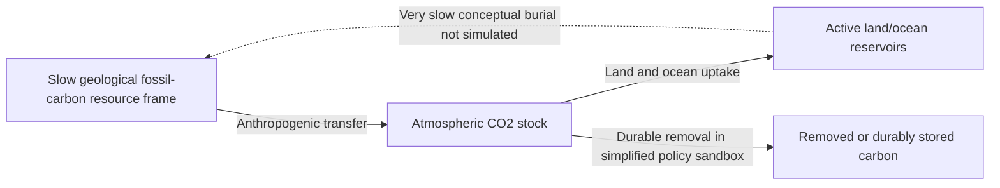

# Carbon Beyond the Bathtub | Visual model guide

[Open the interactive demo](https://aryakia.github.io/carbon-cycle-demo/) · [Scientific methods and sources](../README.md) · [Public game source](../game.html)

This is a **conceptual educational simulation**, not a complete Earth-system model, causal impact study or quantitative climate forecast. The historical reference replay and the forward-looking policy sandbox have different evidentiary status. The live site could not be independently reached during this review; the checked-in public pages remain inspectable.

## Carbon-stock interpretation

**Reading the last arrow:** Durable removal is a *subtraction from* atmospheric carbon, not an inflow. The conceptual `R` box is **not** an explicitly simulated stock, and the geological return arrow is not a simulated fast replenishment. The historical replay uses published concentration/reference anchors and interpolated fossil-transfer context; it does **not** reconstruct all historical annual sink fluxes.

## Five-minute public demonstration

These are **suggested actions to try** in the existing [game](../game.html), not results of an automated browser test:

1. Enter the historical replay and select 1750; note the atmospheric **ppm** label and source/assumption legend.
2. Move the historical slider toward 2026 and observe the atmospheric display. Do not infer an annual sink flux from historical concentration alone.
3. Inspect the carbon ledger: distinguish resource-frame PgC/GtC, transferred carbon and atmospheric carbon. The [README](../README.md) explains that roughly 2.12 GtC per ppm is an approximate conversion, **not** a direct measurement of all carbon reservoirs.
4. Switch to Policy Lab (2026–2100) and change one user-controlled inflow or removal assumption. Any result is a **conditional simplified simulation**, not a forecast or a historical observation.
5. Restore the initial controls and compare the different visual meanings of anthropogenic inflow, land/ocean uptake and geological return.

## Acceptance checks for a later tested release

| Check | Expected interpretation |
| --- | --- |
| Carbon-balance calculation | Atmospheric change = anthropogenic inflow − uptake − durable removal; all terms use consistent carbon units. |
| Slider boundaries | Historical replay stays in its documented historical range; scenario controls affect the sandbox, not archived observations. |
| Conversion | Report ppm and GtC as different units; document the approximate conversion. |
| Negative and missing inputs | Do not display nonsensical stocks or silently invent observations. |
| Navigation and accessibility | Keyboard slider, focus visibility and controls remain usable; diagram/stock labels are legible on mobile. |

These are **proposed checks**, not tests executed or demonstrated as passing in this documentation change. No model equations, constants or historical anchors were altered.

## Image integrity

No screenshot was generated. For a genuine capture, open the actual demo, record date, selected tab, year and parameter settings, and label replay versus Policy Lab. Do not call this Mermaid diagram a screenshot or suggest natural uptake rapidly rebuilds fossil resources.

## GitHub About fields — proposed, not applied

- **Description:** `Interactive carbon-cycle learning demo separating historical CO2 replay from a simplified policy sandbox.`
- **Topics:** `system-dynamics`, `carbon-cycle`, `climate-education`, `simulation`, `interactive-visualization`
- **Homepage:** `https://aryakia.github.io/carbon-cycle-demo/` (verify accessibility before applying).

The public code, numerical model, licenses and deployment configuration are unchanged.