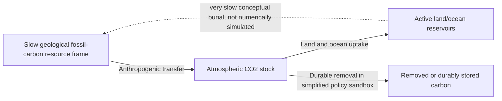

# Carbon Beyond the Bathtub | Visual model guide

[Launch the public interactive demo](https://aryakia.github.io/carbon-cycle-demo/) · [Existing scientific README](../README.md) · [Game source](../game.html)

This is a **conceptual educational simulation**, not a complete Earth-system model, causal impact study or quantitative climate forecast. The historical replay and forward-looking sandbox have different evidentiary status.

## Carbon-stock interpretation

**Reading the final arrow:** Durable removal is a *subtraction from* the atmospheric stock, not an inflow. For a numerical statement use the README's equation: **change in atmospheric carbon = anthropogenic inflow − natural uptake − durable removal**. The historical replay uses published concentration/reference anchors and interpolated fossil-transfer context; it does **not** reconstruct all historical annual sink fluxes. The 2026–2100 sandbox uses user-controlled simplified assumptions. The endpoint `R` is an explanatory placeholder, not a separately simulated stock.

## Inspectable public artifacts

The repository already publishes [game.html](../game.html) and [index.html](../index.html) and documents IPCC, Global Carbon Budget and NOAA sources in its README. The public demo should be used as the primary visual example rather than representing a conceptual diagram as a screenshot.

## Screenshot / demonstration capture

No additional screenshot was generated in this PR. For an actual capture, open the public game, record the displayed date and settings, and label a historical replay separately from a hypothetical Policy Lab run. In any quantitative image, distinguish ppm from GtC and do not imply that atmospheric uptake quickly replenishes fossil reserves.

## Suggested GitHub About fields (not applied)

- **Description:** `Interactive carbon-cycle learning demo separating historical CO2 replay from a simplified policy sandbox.`
- **Topics:** `system-dynamics`, `carbon-cycle`, `climate-education`, `simulation`, `interactive-visualization`
- **Homepage:** `https://aryakia.github.io/carbon-cycle-demo/` (check live access before applying).

No model equations, numerical inputs, sources, site deployment configuration or licences are changed by this document.